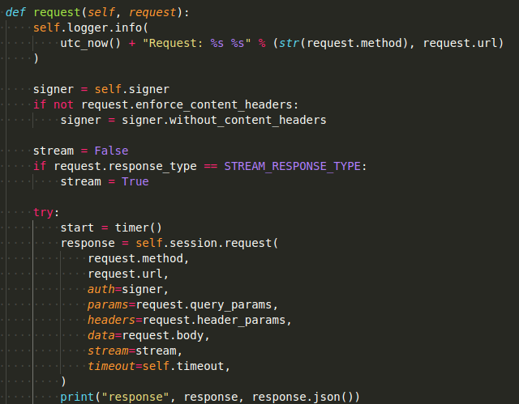

## How to debug?

On module `oci==2.32.0` you can look for the file `base_client.py`.
In this file you can look for the method `request`, inside it you can find the calling for the method `self.session.request` which returns a response object.
You can use this object to debug the raw response for the API request.

Usually the raw response property names uses camelCase, the oci-sdk convert it to lowercase with words separated by underscores(Snake Case).
Ex.: the raw property name `compartmentId` becomes `compartment_id` on oci-sdk return.
